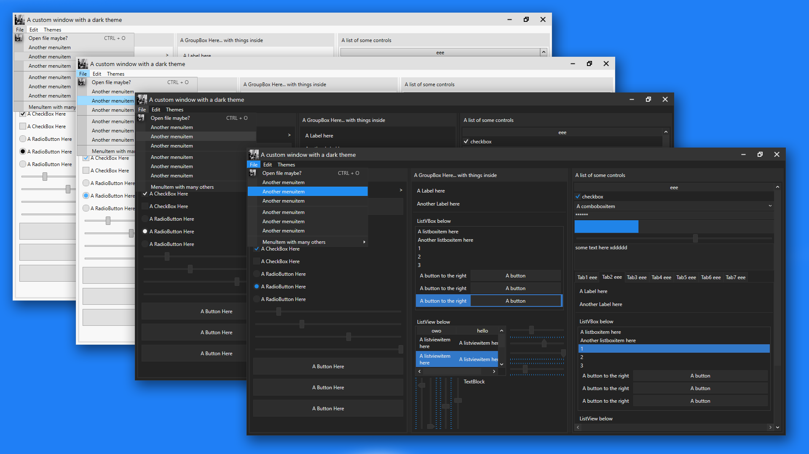

# The Dark Theme app
I started making this so that me, or anyone really, can easily have a nice looking theme on their program without needing to write any extra code. 
### There's currently 4 themes: Light, Colourful Light, Dark and Colourful Dark. Colourful mainly adds extra colours to controls when you hover over them or select them.
Here's a preview of the latest update: (Order is: Light, ColourfulLight, Dark, ColourfulDark).

# Latest Updates (time is from bottom to top)
- Made menuitems autostyle, improved the looks of disabled controls (which use a textblock as their content, e.g. buttons or menuitems), and also made the maximize/restore button change based on the window state
- Finally added a shadow to windows. Also added drop shadows to tooltips, context menus and menuitems. These shadows however do introduct another thing... when resizing the window, a white border apears along the axis youre resizing in. It dissapears as soon as the window has fully re-drawn (aka after you stop resizing). idk how to fix this but tbh its not that big of a deal so it can just be ignored 
- Had to change the slider to fix the orientations and the tick placements. they now no longer have the blue trail after them. although i could try and add it later
- Colourful Light/Dark theme has arrived! i find the Colourful light theme and original dark theme go well, but that's my opinion ;)
- Themed the titlebar! All of the buttons' functionality (close, minimize, autothing) automatically apply to any window.
- Improved the ComboBox; themed the ComboBoxItems and other controls too
- added more colours to be used for styling, and a "special primary colour", which is dark blue atm.
- Improved the slider; rounded corners on the slider thumb, and the slider uses the "special primary colours" instead of plain grey.
- Also improved the ScrollBars (the scroll handle bit was darker than the backgroundy bit, so i changed that.
- Added some colours to the light theme too (not sure why you'd want to use it but eh)
- And finally improved the RadioBoxes by giving them a more circular shape, like they normally have.
### Some smaller updates
- Removed the update from below because making the foreground white doesnt affect custom controls... stays black but the colours are lighter so the black looks okay with blue
- Improved colourful light theme by making the foreground of any blue surface white instead of black so that it stands out better.
# How to install/use
Firstly, in your WPF project, right click References in the solution explorer bit, add reference, goto Assemblies and double click/include PresentationFramework.Aero2. this allows the use of drop shadows and stuff.
Then, just drag and drop the theme(s) you want (located in the Themes folder folder btw) into your project (i'd recommend putting them inside a themes folder jus to be organised) and inside App.xaml place this: (and repalce DarkTheme with whatever theme you want, like LightTheme, ColourfulDarkTheme, etc)
```xml
<Application.Resources>
    <ResourceDictionary>
        <ResourceDictionary.MergedDictionaries>
            <ResourceDictionary Source="/ThemesFolder/DarkTheme.xaml"/>
        </ResourceDictionary.MergedDictionaries>
    </ResourceDictionary>
</Application.Resources>
```
and then most things like buttons, listboxes, etc, will automatically be styled. Then to style windows... 
# How to style windows
in your window xaml code (where you define height/width, etc), add
```xml
Style="{DynamicResource CustomWindowStyle}"
```
CustomWindowStyle styles the titlebar, buttons, etc.
there's also CustomToolWindowStyle which is the same as CustomWindowStyle but cant be resized, and MainWindowStyle which is the exact same as the default window but with a dark background
