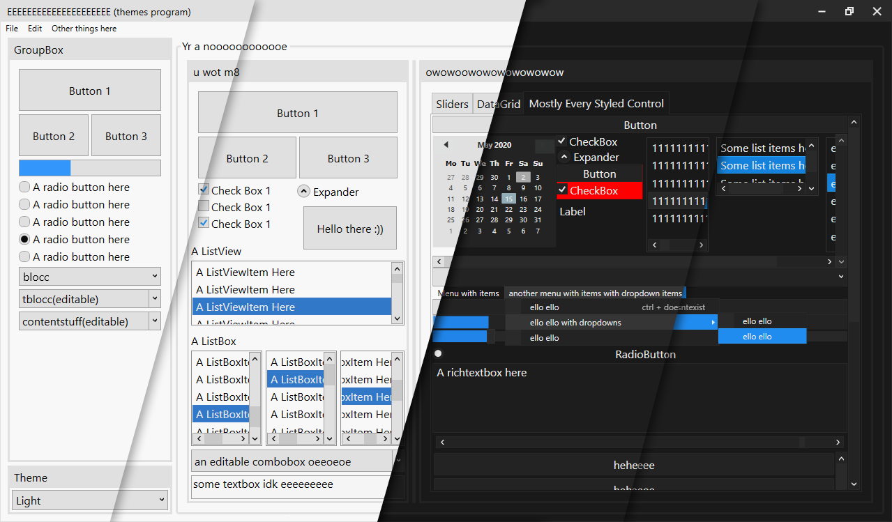

# The Dark Theme app
I started making this so that me, or anyone really, can easily have a nice looking theme on their program without needing to write any extra code. 
### There's currently 4 themes: Light, Colourful Light, Dark and Colourful Dark. Colourful mainly adds extra colours to controls when you hover over them or select them.
Here's a preview of the latest update: (Order is: Light, ColourfulLight, Dark, ColourfulDark). Actual app layout has changed since then but the theme is still the same

# Latest Updates (time is from bottom to top)
- Colourful Light/Dark theme has arrived! i find the Colourful light theme and original dark theme go well, but that's my opinion ;)
- Themed the titlebar! All of the buttons' functionality (close, minimize, autothing) automatically apply to any window.
- Improved the ComboBox; themed the ComboBoxItems and other controls too
- added more colours to be used for styling, and a "special primary colour", which is dark blue atm.
- Improved the slider; rounded corners on the slider thumb, and the slider uses the "special primary colours" instead of plain grey.
- Also improved the ScrollBars (the scroll handle bit was darker than the backgroundy bit, so i changed that.
- Added some colours to the light theme too (not sure why you'd want to use it but eh)
- And finally improved the RadioBoxes by giving them a more circular shape, like they normally have.
### Some smaller updates
- Improved colourful light theme by making the foreground of any blue surface white instead of black so that it stands out better.
# How to install/use
just drag and drop the theme(s) you want (located in the ThemesFolder folder btw) into your project (i'd recommend putting them inside a themes folder) and inside App.xaml place this: (and repalce DarkTheme with whatever theme you want, like LightTheme, ColourfulDarkTheme, etc)
```xml
<Application.Resources>
    <ResourceDictionary>
        <ResourceDictionary.MergedDictionaries>
            <ResourceDictionary Source="/ThemesFolder/DarkTheme.xaml"/>
        </ResourceDictionary.MergedDictionaries>
    </ResourceDictionary>
</Application.Resources>
```

# How to use MenuItems properly (sort of)
MenuItems are relatively challenging to auto-style, so they require just a tiny bit of effort to give them the correct theme. MenuItems use a POPUP thingy which is quite difficult to get to work sometimes. But i think i did okay tbh. However, the arrow thing doesn't auto show, so you have to account for that unfortunately. There are 2 templates: SingleDropDownMenuItem (for a menuitem that wont have children), and DropDownMenuItemStyle. the genuin only difference between the 2 is the little arrow that shows when a menuitem has children.
this is the code for making a fully themed menu:
```xml
<Menu VerticalAlignment="Top">
    <MenuItem Header="File">
        <MenuItem Header="Save"       Template="{DynamicResource SingleDropDownMenuItem}"/>
        <MenuItem Header="Save as..." Template="{DynamicResource DropDownMenuItemStyle}">
            <MenuItem Header="Text File (txt)" Template="{DynamicResource SingleDropDownMenuItem}"/>
            <MenuItem Header="XML (xml)"       Template="{DynamicResource SingleDropDownMenuItem}"/>
            <MenuItem Header="C# File (cs)"    Template="{DynamicResource SingleDropDownMenuItem}"/>
        </MenuItem>
        </MenuItem>
    </MenuItem>
</Menu>
```
# How to use the TabControls properly (with add/close buttons)
I added 2 different templates for tabcontrols and tabitem; normal ones and ones with add/close buttons. to use them, you first need to set the DataContext of the tabcontrol, or set the datacontext of the window the tabcontrol is on, like the mainwindow. this datacontext would be set to a class (MainViewModel maybe) which contains 2 ICommands:
```
public ICommand NewTabCommand { get; set; }
public ICommand CloseTabCommand { get; set; }
```
You can change these in the (Theme).xaml file. These commands automatically bind when the datacontext is set. How you setup clicking Add or Close to do something is up to you; i use a custom class i made called Command which is included in this program.
For giving tabcontrols/tabitems the add/close buttons, use these templates:
```
Template="{DynamicResource CloseButtons}" 
Template="{DynamicResource AddButtons}"
```
use the CloseButtons on TabItems, and the AddButtons template on the TabControl
Use this code for a normal tabcontrol with tabitems:
```xml
<TabControl>
    <TabItem Header="A TabItem Here">
        <Grid/>
    </TabItem>
</TabControl>
```
and for using add/close buttons, use this:
```xml
<TabControl Template="{DynamicResource AddButtons}">
    <TabItem Header="A TabItem Here" Template="{DynamicResource CloseButtons}">
        <Grid/>
    </TabItem>
</TabControl>
```
I should mention, i haven't yet adjusted the size (well, the height) of the CloseButtons template. so the TabItem will be bigger than normal, meaning the tabs will be bigger unfortunately. will fix soon
## Other things 
Also, if you absolutely need my consent to do stuff like edit/use this theme stuff, then you can edit this and publish this all you want :) would be nice if you credited me at this github link, but eh.
